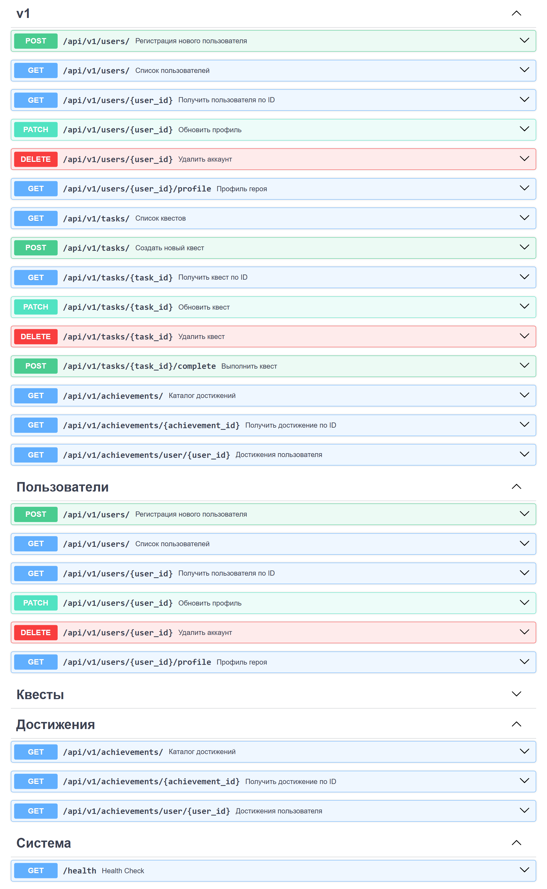

# 🎮 LifeQuest Backend API

Бэкенд-часть геймифицированного трекера задач в формате RPG. Каждая задача — это квест, за выполнение которого герой получает опыт, монеты и достижения.

⚠️ **Текущий статус:** Завершен Спринт 2 (MVP). Бэкенд переведен на работу с реальной базой данных PostgreSQL, внедрена JWT-авторизация и реализованы базовые CRUD-операции.

 

## 🛠 Технологический стек
* **Фреймворк:** FastAPI (Python 3.10+)
* **База данных:** PostgreSQL 15 + SQLAlchemy 2.0 (ORM) + Alembic (Миграции)
* **Кэш / Очереди:** Redis + Celery
* **Безопасность:** JWT (Access/Refresh токен), bcrypt (хеширование паролей)
* **Инфраструктура:** Docker, docker-compose

---

## 🚀 Быстрый старт (Docker)

Для запуска бэкенда локально потребуется только установленный Docker.

**1. Клонировать репозиторий:**
```bash
git clone [https://codelab.tpu.ru/egk17/lifequest.git](https://codelab.tpu.ru/egk17/lifequest.git)
cd lifequest/lifequest-backend

```

**2. Настроить переменные окружения:**

```bash
cp .env.example .env

```

*(В файле `.env.example` уже заданы дефолтные параметры для локального запуска).*

**3. Поднять контейнеры:**

```bash
docker-compose up -d --build

```

**4. Применить миграции и наполнить базу стартовыми данными:**

```bash
docker-compose exec api alembic upgrade head
docker-compose exec api python seed.py

```

**5. Открыть документацию API:**

* Swagger UI: [http://localhost:8000/docs](https://www.google.com/search?q=http://localhost:8000/docs)
* ReDoc: [http://localhost:8000/redoc](https://www.google.com/search?q=http://localhost:8000/redoc)

---

## 📡 Информация для Frontend-разработчиков (Работа с JWT)

API использует JWT-авторизацию. Большинство эндпоинтов закрыты для неавторизованных пользователей.

**Как работать с авторизацией:**

1. Зарегистрируйте пользователя: `POST /api/v1/users/`
2. Получите токен: `POST /api/v1/auth/login` (данные передаются как `application/x-www-form-urlencoded`).
3. Сервер вернет JSON с `access_token`.
4. В последующие запросы к API добавляйте HTTP-заголовок:
`Authorization: Bearer <ваш_access_token>`

**Ключевые эндпоинты:**

* `GET /api/v1/users/me` — профиль текущего авторизованного героя (RPG-статистика).
* `GET /api/v1/tasks/` — список квестов (изолированно, возвращает задачи только владельца токена).
* `GET /api/v1/achievements/` — каталог доступных достижений.

---

## 🏗 Архитектура проекта

```text
lifequest-backend/
├── alembic/        # Файлы миграций базы данных
├── app/
│   ├── api/        # Роуты (эндпоинты) API v1
│   ├── core/       # Конфигурация, безопасность, подключение к БД
│   ├── models/     # SQLAlchemy ORM модели (User, Task, Achievement, UserBuff)
│   ├── schemas/    # Pydantic-схемы (контракты запрос/ответ)
│   └── main.py     # Точка входа FastAPI
├── .env.example    # Шаблон переменных окружения
├── docker-compose.yml
└── seed.py         # Скрипт наполнения БД стартовыми данными

```